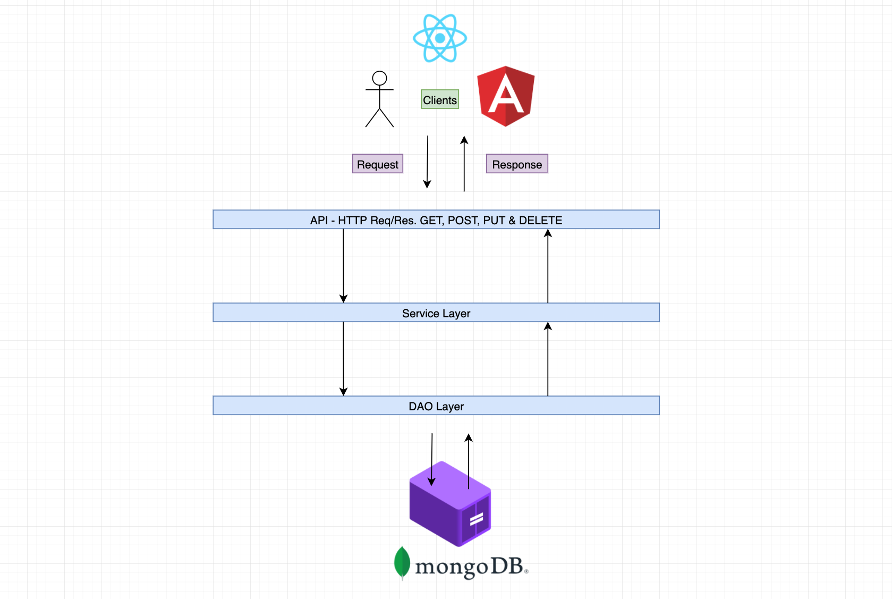

# SpringMongoDb
This project was developed using the tutorial provided by AmigosCode Spring Data + MongoDB course.

# Tech used
Docker, Java 17, MongoDB, Postgres, SpringBoot, and Maven.

# Architecture Diagram

